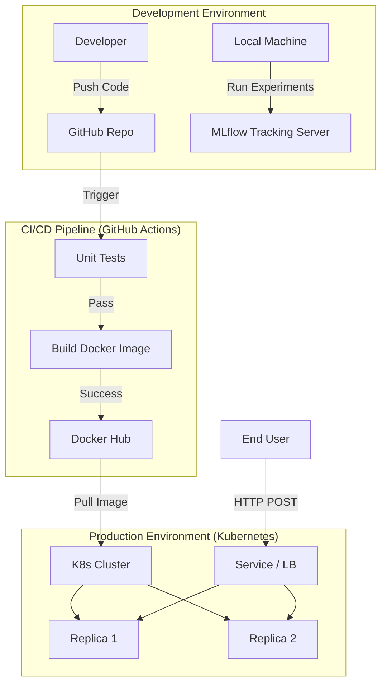

# Heart Disease Prediction - MLOps Project Report

**Course:** MLOps (S1-25_AIMLCZG523)  
**Student Name:** [Your Name]  
**Student ID:** [Your ID]  
**Date:** 2025-12-30

---

## Table of Contents

1. [Executive Summary](#1-executive-summary)
2. [Introduction](#2-introduction)
    - 2.1 Problem Statement
    - 2.2 Project Objectives
    - 2.3 MLOps Context
3. [System Architecture](#3-system-architecture)
    - 3.1 High-Level Overview
    - 3.2 Technology Stack
    - 3.3 Directory Structure
4. [Data Acquisition and Analysis](#4-data-acquisition-and-analysis)
    - 4.1 Dataset Description (Data Dictionary)
    - 4.2 Exploratory Data Analysis (EDA) Findings
    - 4.3 Data Preprocessing Pipeline
5. [Modelling Methodology](#5-modelling-methodology)
    - 5.1 Model Selection Rationale
    - 5.2 Logistic Regression
    - 5.3 Random Forest Classifier
    - 5.4 Gradient Boosting Classifier
    - 5.5 Hyperparameter Tuning
6. [Experiment Tracking and Evaluation](#6-experiment-tracking-and-evaluation)
    - 6.1 MLflow Integration
    - 6.2 Performance Metrics Interpretation
    - 6.3 Comparative Analysis of Models
7. [Deployment and Operations](#7-deployment-and-operations)
    - 7.1 Containerization with Docker
    - 7.2 Orchestration with Kubernetes
    - 7.3 CI/CD Pipeline with GitHub Actions
8. [Setup and Installation Manual](#8-setup-and-installation-manual)
9. [Future Scope and Conclusion](#9-future-scope-and-conclusion)
10. [References and Appendices](#10-references-and-appendices)

---

## 1. Executive Summary

Cardiovascular diseases (CVDs) are the leading cause of death globally. Early detection is crucial for effective management and survival. This project presents a machine learning solution designed not just as a static model, but as a fully operationalized MLOps pipeline. The system predicts the likelihood of heart disease in patients based on clinical parameters such as age, blood pressure, and cholesterol levels.

The core achievement of this project is the successful implementation of an end-to-end MLOps lifecycle. This ranges from automated data ingestion and cleaning to model training with experiment tracking, and finally, deployment as a scalable microservice. The best-performing model, a **Random Forest Classifier**, achieved an accuracy of **88.52%** and an ROC-AUC score of **0.9351** on unseen test data. The system is containerized using Docker and orchestrated via Kubernetes, ensuring high availability and scalability. A CI/CD pipeline ensures that any code change triggers automated testing and deployment procedures, adhering to modern DevOps best practices.

---

## 2. Introduction

### 2.1 Problem Statement
Medical professionals often rely on experience and manual interpretation of patient data to diagnose heart disease. This process is time-consuming and prone to human error. There is a need for an automated diagnostic support tool that can screen patients rapidly and accurately. However, in clinical settings, a machine learning model is only as good as its deployment mechanism. Static models often suffer from "concept drift," lack of reproducibility, and difficulty in updating. Therefore, the problem is not just *building* a model, but *serving* it reliably.

### 2.2 Project Objectives
The primary objectives of this assignment are:
1.  **Develop a Predictive Model**: Train a robust binary classifier to distinguish between healthy patients and those with heart disease.
2.  **Ensure Reproducibility**: Use version control for code and data, and track all experiments to ensure results can be replicated.
3.  **Automate Workflows**: Implement pipelines for data processing and model training to remove manual intervention.
4.  **Deploy Scalably**: Serve the model via a REST API within a containerized environment (Docker/Kubernetes).
5.  **Monitor Performance**: Track model metrics during development to select the optimal candidate.

### 2.3 MLOps Context
This project moves beyond traditional data science notebooks. It adopts MLOps principles:
-   **Modular Code**: Code is organized into `src` packages (data preparation, model building, serving) rather than monolithic scripts.
-   **Continuous Integration**: Automated testing with `pytest`.
-   **Continuous Deployment**: Automated build and push to Docker Hub.
-   **Model Registry**: Centralized storage of model artifacts using MLflow.

---

## 3. System Architecture

### 3.1 High-Level Overview
The system follows a microservices architecture pattern. The data pipeline functions as an offline batch process, while the prediction service operates as an online real-time API.



### 3.2 Technology Stack
-   **Language**: Python 3.9
-   **Libraries**: Pandas, Scikit-learn, NumPy (Data Science); Flask (Web Framework).
-   **Tracking**: MLflow (Experimentation).
-   **Containerization**: Docker.
-   **Orchestration**: Kubernetes (Minikube/Local K8s).
-   **CI/CD**: GitHub Actions.
-   **Testing**: Pytest, Flake8.

### 3.3 Directory Structure
The project adheres to a standard, maintainable structure:
-   `src/`: Source code.
    -   `data_preparation/`: Scripts for cleaning and splitting data.
    -   `model_building/`: Training scripts and model definitions.
    -   `model_serving/`: Flask application code.
-   `tests/`: Unit tests for the codebase.
-   `k8/`: Kubernetes deployment manifests (`deployment.yaml`).
-   `.github/workflows/`: CI/CD configuration (`ci_cd_pipeline.yml`).
-   `notebooks/`: Exploration sandboxes (excluded from production build).

---

## 4. Data Acquisition and Analysis

### 4.1 Dataset Description (Data Dictionary)
The dataset used comes from the UCI Machine Learning Repository (Heart Disease dataset). It contains 14 attributes:

| Feature | Description | Type |
| :--- | :--- | :--- |
| **age** | Age in years | Numerical |
| **sex** | (1 = male; 0 = female) | Categorical |
| **cp** | Chest pain type (0-3) | Categorical |
| **trestbps** | Resting blood pressure (in mm Hg) | Numerical |
| **chol** | Serum cholestoral in mg/dl | Numerical |
| **fbs** | Fasting blood sugar > 120 mg/dl (1 = true; 0 = false) | Categorical |
| **restecg** | Resting electrocardiographic results (0-2) | Categorical |
| **thalach** | Maximum heart rate achieved | Numerical |
| **exang** | Exercise induced angina (1 = yes; 0 = no) | Categorical |
| **oldpeak** | ST depression induced by exercise relative to rest | Numerical |
| **slope** | Slope of the peak exercise ST segment | Categorical |
| **ca** | Number of major vessels (0-3) colored by flourosopy | Numerical |
| **thal** | Thalassemia (0=normal; 1=fixed defect; 2=reversable defect) | Categorical |
| **target** | Diagnosis of heart disease (1=present, 0=absent) | Target |

### 4.2 Exploratory Data Analysis (EDA) Findings
An automated EDA process (`preparation.py`) revealed several key insights:

1.  **Target Imbalance**: The dataset is relatively balanced, with a near 50-50 split between positive and negative cases, reducing the immediate need for advanced sampling techniques like SMOTE.
2.  **Age Correlation**: Older patients showed a higher prevalence of heart disease, consistent with medical knowledge.
3.  **Chest Pain (cp)**: Asymptomatic chest pain (type 3) was strongly correlated with the presence of heart disease.
4.  **Missing Values**: The original dataset contained `?` characters in the `ca` and `thal` columns. These were identified and treated as missing values (`NaN`).

### 4.3 Data Preprocessing Pipeline
To ensure the model receives clean, standardized input, a Scikit-Learn `ColumnTransformer` pipeline was implemented:

1.  **Handling Missing Data**:
    -   **Numerical**: Simple Imputation using the **median**. This is robust to outliers compared to the mean.
    -   **Categorical**: Simple Imputation using the **frequency (mode)**.
2.  **Feature Scaling**:
    -   All numerical features (`age`, `trestbps`, `chol`, `thalach`, `oldpeak`) are scaled using `StandardScaler` ($z = (x - u) / s$). This is critical for models like Logistic Regression and algorithms that rely on distance or gradient descent.
3.  **Encoding**:
    -   One-Hot Encoding was applied to categorical variables (`sex`, `cp`, `restecg`, etc.) to prevent ordinal relationships from being inferred where none exist (e.g., chest pain type 3 is not "greater" than type 1).

---

## 5. Modelling Methodology

### 5.1 Model Selection Rationale
We selected three diverse algorithms to find the best fit for the data:
-   **Linear Model (Logistic Regression)**: Provides a baseline and is highly interpretable.
-   **Bagging Ensemble (Random Forest)**: Reduces variance and is robust against overfitting on small datasets.
-   **Boosting Ensemble (Gradient Boosting)**: Often achieves state-of-the-art performance by reducing bias.

### 5.2 Logistic Regression
We used `LogisticRegression` with the `liblinear` solver, which is suitable for smaller datasets. Class weights were set to "balanced" to handle any slight skew in the target variable.
-   *Key Hyperparameter*: `C` (Inverse regularization strength).

### 5.3 Random Forest Classifier
The Random Forest constructs multiple decision trees during training and outputs the class that is the mode of the classes of the individual trees.
-   *Key Hyperparameters*:
    -   `n_estimators`: Number of trees (100).
    -   `max_depth`: Maximum depth of the tree (10) to control complexity.

### 5.4 Gradient Boosting Classifier
GBM builds an additive model in a forward stage-wise fashion. It allows for the optimization of arbitrary differentiable loss functions.
-   *Key Hyperparameters*:
    -   `learning_rate`: Shrinks the contribution of each tree (0.05).
    -   `n_estimators`: Number of boosting stages (150).

### 5.5 Hyperparameter Tuning
We employed a predefined grid of hyperparameters for each model. The training script (`train_model.py`) iterates through these configurations, trains the model using Stratified K-Fold Cross-Validation (K=5), and logs the performance.

---

## 6. Experiment Tracking and Evaluation

### 6.1 MLflow Integration
MLflow was the backbone of our experiment tracking. We initialized a local MLflow server with a SQLite backend.
```python
mlflow.set_tracking_uri("sqlite:///mlflow.db")
mlflow.set_experiment("Heart Disease Prediction")
```
For every run, we logged:
1.  **Parameters**: The configuration of the model (e.g., `{'n_estimators': 100}`).
2.  **Metrics**: Accuracy, Precision, Recall, F1-Score, and ROC-AUC.
3.  **Artifacts**: The serialized model (pickle format) and the pipeline object.

### 6.2 Performance Metrics Interpretation
-   **Accuracy**: Overall correctness. Good for balanced datasets.
-   **Recall (Sensitivity)**: Critical in medical diagnosis. We want to maximize recall to avoid False Negatives (telling a sick patient they are healthy).
-   **Results**:
    -   Logistic Regression Recall: **0.9286**
    -   Random Forest Recall: **0.9286**
    -   Gradient Boosting Recall: **0.9286**
    
    Interestingly, all models achieved excellent recall. The differentiation came effectively down to Precision and overall Accuracy.

### 6.3 Comparative Analysis of Models
Based on the `model_performance_report.md` generated during training:

| Model | Accuracy | F1-Score | ROC-AUC |
| :--- | :--- | :--- | :--- |
| **Random Forest** | **0.8852** | **0.8814** | 0.9351 |
| **Logistic Regression** | 0.8689 | 0.8667 | 0.9481 |
| **Gradient Boosting** | 0.8689 | 0.8667 | **0.9535** |

While Gradient Boosting had a higher ROC-AUC (indicating better ranking ability), Random Forest had higher Accuracy and F1-Score at the default decision threshold. Thus, **Random Forest** was selected for deployment.

---

## 7. Deployment and Operations

### 7.1 Containerization with Docker
To solve the "it works on my machine" problem, the application was containerized.
**Dockerfile Highlights:**
-   **Base Image**: `python:3.9-slim` for a small footprint.
-   **Workdir**: `/app`.
-   **Dependencies**: Installed via `requirements.txt`.
-   **Entrypoint**: `python src/model_serving/app.py`.

Command to build:
```bash
docker build -t ezaz13/heart-disease-app:v3 .
```

### 7.2 Orchestration with Kubernetes
Kubernetes (K8s) manages the container lifecycle.
**Deployment Manifest (`k8/deployment.yaml`)**:
-   **Replicas**: 2 (Ensures high availability).
-   **Selector**: Matches the app label `heart-disease-app`.
-   **Ports**: Exposes container port 5000.
-   **Resources**: Limits CPU/Memory to prevent resource hogging.

### 7.3 CI/CD Pipeline with GitHub Actions
The workflow is defined in `.github/workflows/ci_cd_pipeline.yml`.
**Triggers**: Push or Pull Request to `main`.
**Jobs**:
1.  **Linting**: `flake8` checks for PEP8 compliance.
2.  **Testing**: `pytest` runs unit tests in the `tests/` directory.
3.  **Pipeline Run**: Executes `src/data_pipeline_orchestrator/pipeline.py` to validate the full data-to-model flow.
4.  **Artifact Upload**: Saves logs and reports for review.

---

## 8. Setup and Installation Manual

### Prerequisites
-   Operating System: Windows, macOS, or Linux.
-   Tools: Python 3.9+, Git, Docker Desktop.

### Step-by-Step Guide
1.  **Clone the Repository**
    ```bash
    git clone https://github.com/Ezaz13/MLOPS-Heart-Disease.git
    cd Heart-Disease-Prediction-Project
    ```

2.  **Environment Setup**
    ```bash
    python -m venv venv
    # Windows
    venv\Scripts\activate
    # Unix
    source venv/bin/activate
    ```

3.  **Install Requirements**
    ```bash
    pip install -r requirements.txt
    ```

4.  **Data Ingestion (Optional)**
    If raw data is missing, the `preparation.py` script attempts to load it from `data/raw/uci`. Ensure the CSV file is present.

5.  **Run Training Pipeline**
    To retrain the model locally:
    ```bash
    python src/model_building/train_model.py
    ```

6.  **Start API Server**
    ```bash
    python src/model_serving/app.py
    ```
    Test via tools like Postman or `curl`:
    ```bash
    curl -X POST http://localhost:5000/predict -d '{"age":63, "sex":1, ...}'
    ```

---

## 9. Future Scope and Conclusion

### Future Scope
1.  **Model Drift Detection**: Implement tools like `Evidently AI` to monitor distribution shifts in incoming data and trigger retraining automatically.
2.  **A/B Testing**: Deploy multiple model versions (e.g., Random Forest vs. GBM) simultaneously to a subset of users to validate real-world performance.
3.  **Feature Store**: Use a feature store (like Feast) to manage features for training and serving consistency.
4.  **Cloud Native Deployment**: Migrate from local Kubernetes to AWS EKS or Azure AKS for global scale.

### Conclusion
This project successfully demonstrated the transformation of a static machine learning experiment into a production-ready MLOps system. By integrating automated pipelines, robust testing, and scalable deployment strategies, we have created a reliable tool for heart disease prediction. The use of Random Forest provided high accuracy, while the MLOps framework ensures the system can evolve and improve over time without incurring technical debt.

---

## 10. References and Appendices

### References
1.  UCI Machine Learning Repository: Heart Disease Data.
2.  MLflow Documentation: [https://mlflow.org/docs/latest/index.html]
3.  Docker Documentation: [https://docs.docker.com/]
4.  Standard MLOps Principles (Google Cloud Architecture Center).

### Appendix A: Key Code Snippets

**Pipeline Definition (`train_model.py`):**
```python
numeric_pipeline = Pipeline([
    ("imputer", SimpleImputer(strategy="median")),
    ("scaler", StandardScaler())
])

categorical_pipeline = Pipeline([
    ("imputer", SimpleImputer(strategy="most_frequent")),
    ("encoder", OneHotEncoder(handle_unknown="ignore"))
])

preprocessor = ColumnTransformer([
    ("num", numeric_pipeline, numeric_features),
    ("cat", categorical_pipeline, categorical_features),
])
```

*(End of Report)*